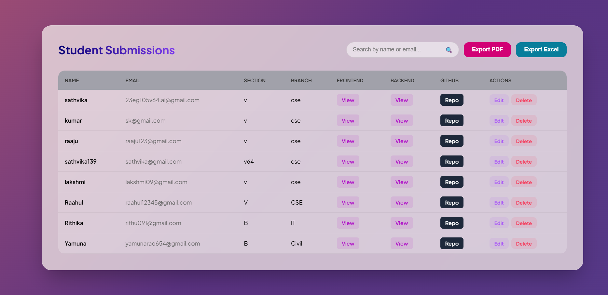

# Submitly 🚀

A modern, responsive Student Project Submission system built with **Spring Boot** and **Thymeleaf**. This application features a high-performance dashboard with real-time searching and a glassmorphism UI.

## 📸 Screenshots

*The main dashboard shows real-time search and student records.*

## ✨ Features
* **Full-Stack Integration**: Built using Spring Boot (Java) for the backend and Thymeleaf for the frontend.
* **Real-time Search**: Instant filtering of student records by name or email without page reloads.
* **Glassmorphism UI**: A professional, modern design using CSS back-drop filters.
* **Project Management**: Full CRUD (Create, Read, Update, Delete) functionality for student submissions.
* **Export Options**: Integrated buttons for exporting data to PDF and Excel.

## 🛠️ Tech Stack
* **Backend**: Java, Spring Boot, Spring Data JPA
* **Frontend**: Thymeleaf, HTML5, CSS3 (Flexbox/Grid), JavaScript
* **Database**: SQL (MySQL/PostgreSQL)
* **Styling**: Google Fonts (Plus Jakarta Sans), Custom CSS

## 🚀 Getting Started

### Prerequisites
* JDK 17 or higher
* Maven
* MySQL/PostgreSQL

### Installation
1. Clone the repository:
   ```bash
   git clone git@github.com:YourUsername/project-pulse.git
   ```
2. Configure your database in src/main/resources/application.properties.

   Build the project:

   ```Bash
   ./mvnw clean install
   ```
   Run the application:

   ```Bash
   ./mvnw spring-boot:run
   ```
